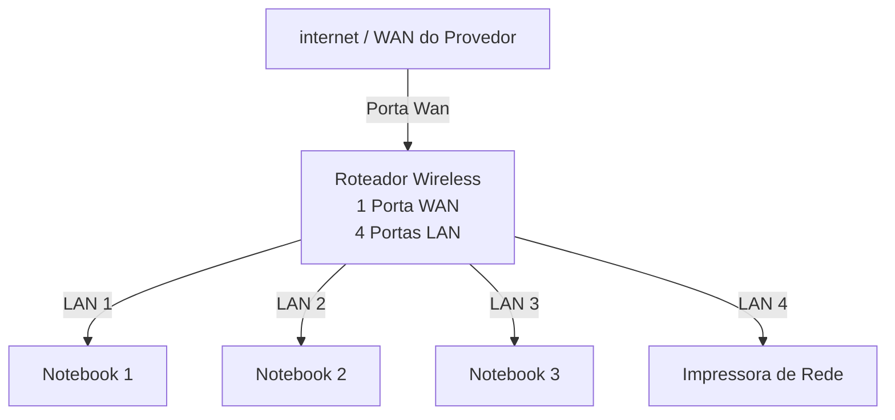
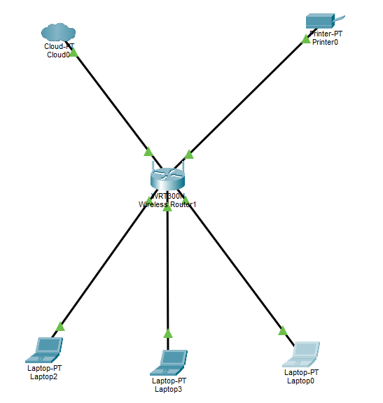

# Laborátorio de Redes 01 - Projeto de Rede Local
Projeto desenvolvido na disciplina de redes de computadores no curso técnico de informática do SENAC Tatuapé 

Aluno: Victor Gabriel

Professor: José de Assis

Data: 09/03/2026 

---

##  1. Objetivo 
Implementar uma rede de local simple conectado 3 notebooks e um roteador wireless com switch integrado e uma impressora de rede.

O projeto será realizado em duas etapas  

1. Simulação da rede no Cisco Packet Tracer 
2. Implementação da rede no labvoratório real 

---
## 2. Equipamento Utilizados neste laboratório 

- 3 Notebooks 
- 1 Roteador Wireless com 1 porta WAN e 4 portas LAN 
- 1 Impressora de rede 
- Cabos de Rede

--- 

## 3. Topologia da Rede 
Diagrama lógico da rede utilizada neste laboratório 

Imagem da Topologia Utilizada no Laboratório:

  
  

  --- 

  ## 4. Plano de endereçamento IP

  Rede: 192,168.0.0/24
  Gateway: 192.168.0.1

  | Dispositivo | Tipo de IP | Endereço de IP | Observação |
  |-------------|-------------|-------------|-------------|
  | Roteador | Estático | 192.168.0.1 | IP do roteador |
  | PC1 | Reserva DHCP | 192.168.0.101 | IP reservado pelo roteador |
  | PC2 | DHCP | Automático| IP atribuido pelo roteador |
  | PC3 | DHCP | Automático| IP atribuido pelo roteador |
  | Impressora | DHCP | automático | IP atribuido pelo roteador |

  **Observação**

  - A impressora e um dos notebooks utilizam reserva DHCP.
  - O roteador sempre atríbui o mesmo endereço IP a esses dispositivos.

  ---

  ## 5. Implementação no laboratório Real 

  Após a instalação, a rede foi montado fisicamente no laboratório

  Etapas realizadas:

  - Fiz a instalação do Windowns 10 na maquina 
  - Realizei a configuração do roteador na maquina principal 

  ## 6. Conclusão 

  Este laboratório permitiu compreender o funcionamento de uma rede local simples, Incluindo 

  - Estrutura de uma rede doméstica ou de um pequeno escritorio 
  - Utilização de um roteador com porta WAN e portas LAN 
  - Funcionamento do DHCP
  - Comunicação entre dispostivos na rede local
  - Utilização de uma impressora de rede
  - Compartilhamento de Pastas 
    
